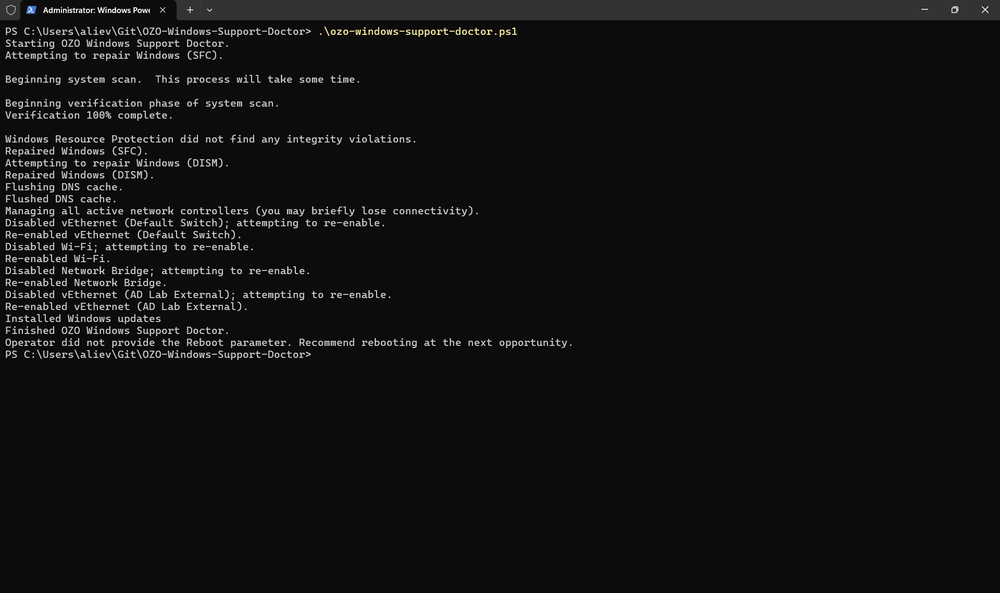

# OZO Windows Support Doctor Installation and Usage
## Description
Performs a series of simple Windows maintenance tasks and [optionally] reboots the computer:
* Runs SFC "scannow"
* Executes a DISM Restore Health
* Flushes the DNS cache
* Cycles the network adapters
* Refreshes Group Policy (domain-joined systems)
* Installs all pending Windows Updates
* [Optional\] reboots the computer

## Screenshot


## Prerequisites
This script requires the `OZOLogger` and `PSWindowsUpdate` PowerShell modules which are available in [PowerShell Gallery](https://learn.microsoft.com/en-us/powershell/scripting/gallery/overview?view=powershell-5.1). Ensure your system is configured for this repository then execute the following in an _Administrator_ PowerShell:

```powershell
Install-Module OZOLogger,PSWindowsUpdate
```

## Installation
This script is published to [PowerShell Gallery](https://learn.microsoft.com/en-us/powershell/scripting/gallery/overview?view=powershell-5.1). Ensure your system is configured for this repository then execute the following in an _Administrator_ PowerShell:

```powershell
Install-Script ozo-windows-support-doctor
```

## Usage
```powershell
ozo-windows-support-doctor
```

## Parameters
|Parameter|Description|
|---------|-----------|
|`Reboot`|Reboots the computer after performing the maintenance tasks.|

## Logging
When the [One Zero One Windows event log provider](https://github.com/onezeroone-dev/OZO-Windows-Event-Log-Provider-Setup/blob/main/README.md) is available, messages are written to Applications and Services > One Zero One > Operational. Otherwise, messages are written to the Microsoft > Windows > PowerShell > Operational provider with event ID 4100.

## Notes
Run this script in an _Administrator_ PowerShell.

## Acknowledgements
Special thanks to my employer, [Sonic Healthcare USA](https://sonichealthcareusa.com), who supports the growth of my PowerShell skillset and enables me to contribute portions of my work product to the PowerShell community.
